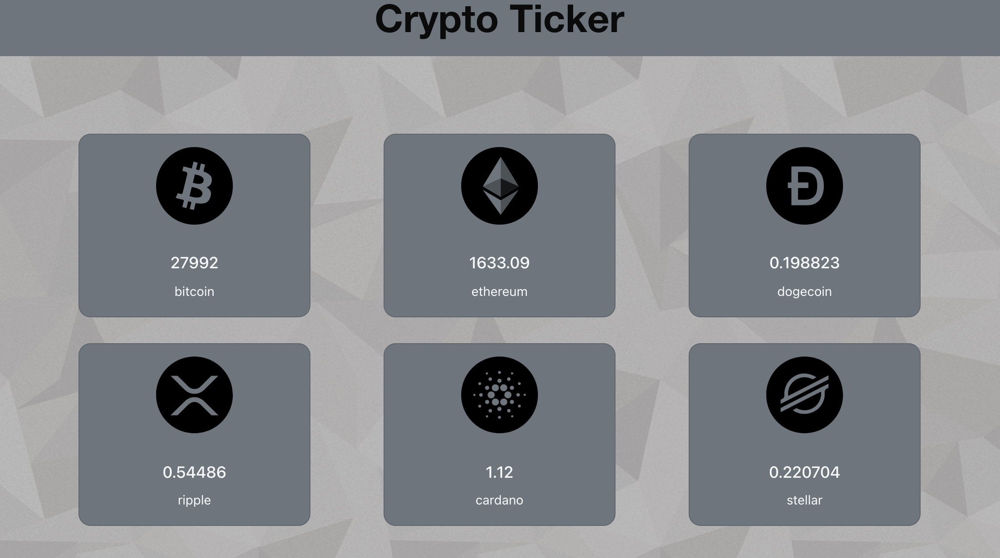

# Crypto Ticker in React

Simple crypto currency ticker built in React using the coingecko API.

## Table of contents

- [Overview](#overview)
  - [The challenge](#the-challenge)
  - [Next steps](#next-steps)
  - [Built with](#built-with)
- [Author](#author)

## Overview

Displaying six currencies and their current prices updated in a 10sec interval: Bitcoin, Ethereum, Dogecoin, Ripple, Cardano and Stellar. Simple Design using Boostrap for React.

### The challenge

Creating a simple card design that automatically adjusts to the amount of currencies entered into the API call. Updating the React state every 10 seconds with updated data via the API. Displaying an animated loader until the data is fetched according to it's interval.

### Next steps

Could further build out the application to let the user decide which crypto currencies to display by adjusting the API call dynamically. Could also learn to enable websockets for real time data management.

### Built with

- React
- Coingecko API

## Author

I'm a self-taught web developer and fresh bootcamp graduate working on my full stack skillset.
Check out my social media below.

- Github - [@Rouven](https://github.com/rouven-d)
- Frontend Mentor - [@Rouven](https://www.frontendmentor.io/profile/rouven-d)
- LinkedIn - [@Rouven Daunke](https://www.linkedin.com/in/rouvendaunke/)
